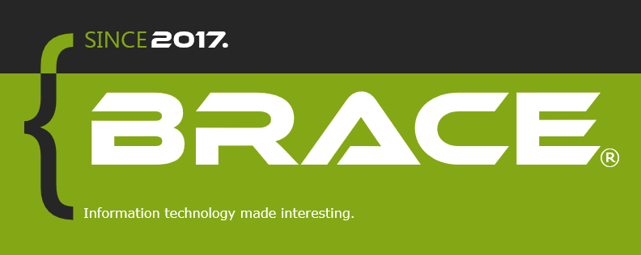

  

- Interested in contribution, development or whatsoever? [Click this link](https://discord.gg/k54r9YVY8R), and join our official Discord server - or [this link](https://github.com/bracetm/samp-wiki) to access the SA:MP wikipedia!

> All of the official products of the `Brace™` team are licensed with `Mozilla Public License`. We're fully open source!

--------------------------------------------------------------------------------------------------------------------------------

### Top languages

| Icon | Language |
|----------------------------------|----------------------------------|
|  | Pawn |
|  | C++ |
|  | PawnScript |
|  | JavaScript |
|  | AMX Assembly |
|  | CSS |
|  | HTML |

For business inquires contact us on any of our social media to get in touch with our support team, or do it via mail bracetm.official@gmail.com.

### Beta program
- Help us extract the best from our products by contacting us at bracetm.official@gmail.com!

©️ Brace™️ Inc.
