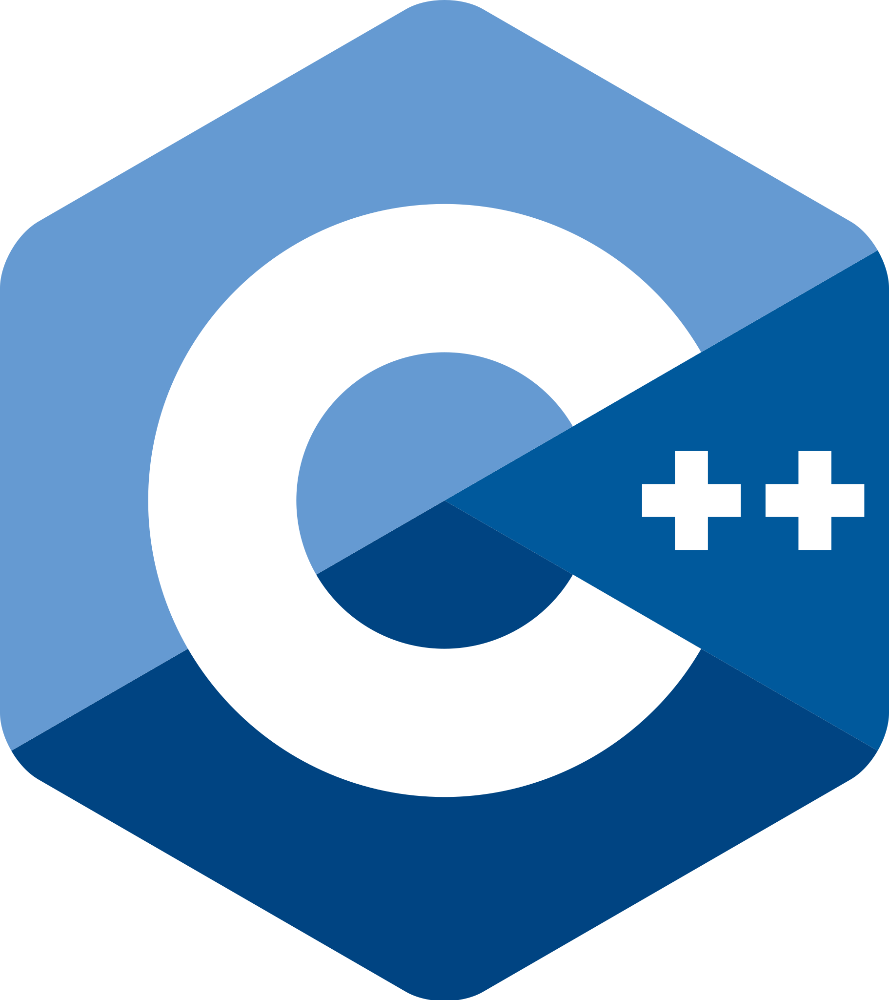
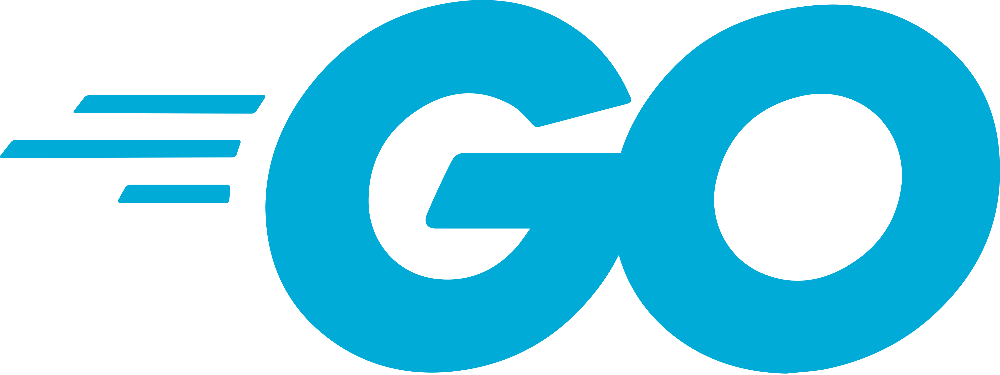
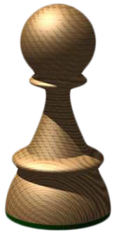
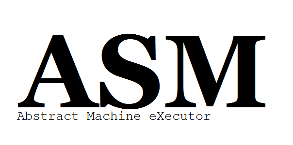

  

## Information technology made interesting.
- Interested in contribution, development or whatsoever? [Click this link](https://discord.gg/k54r9YVY8R), and join our official Discord server!

> All of the official products of the `Brace™` team are licensed with `Mozilla Public License`. We're fully open source!

--------------------------------------------------------------------------------------------------------------------------------

### Top languages

| Icon | Language |
|----------------------------------|----------------------------------|
|  | C++ |
|  | Java |
|  | Go! |
|  | NewASM |
|  | Pawn |
|  | PawnScript |
|  | PawnScript Assembly |
|  | JavaScript |
|  | AMX Assembly |
|  | CSS |
|  | HTML |

For business inquires contact us on any of our social media to get in touch with our support team, or do it via mail bracetm.official@gmail.com.

### Beta program
- Help us extract the best from our products by contacting us at bracetm.official@gmail.com!

### Web
- Access our website via this [link](https://bracesoftware.github.io/web/index.html).

©️ Brace™️ Co.
